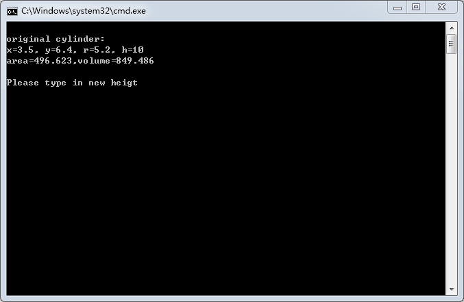
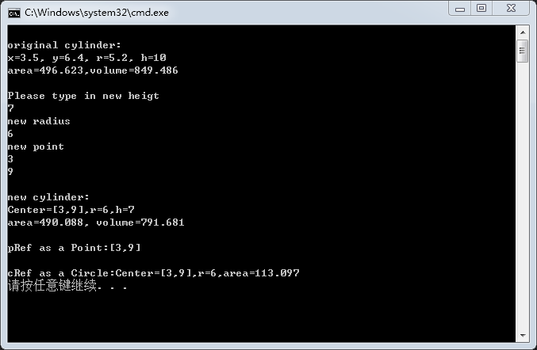

#**电气1604 马俊义 Demo**
<br>此程序首先建立一个Point类，再以此派生出Circle类与Cylinder类，从而实现对圆柱参数的设定与描述、计算
***
1. 用Visual Studio 打开文件Project6.sln
2. 调试与运行<br><br>

3. 输入圆柱高、半径与圆心坐标
4. 得到输出<br><br>

---
#关键代码<br>
1. 类Point的声明<br><br>
```C++
class Point
{
public:
	Point(float x = 0, float y = 0);  
	void setPoint(float, float);  
	float getX()const { return x; }  
	float getY()const { return y; }  
	friend ostream & operator <<(ostream &, const Point &);  
protected:  
	float x, y;
};
```
2. 声明派生类Circle<br><br>
```C++
class Circle :public Point 
{
public:
	Circle(float x = 0, float y = 0, float r = 0);  
	void setRadius(float);  
	float getRadius()const;  
	float area()const;  
	friend ostream &operator <<(ostream &, const Circle &); 
private:
	float radius;
};
```
3. 声明Circle的派生类Cylinder<br><br>
```C++
class Cylinder :public Circle
{
public:
	Cylinder(float x = 0, float y = 0, float r = 0, float h = 0);
	void setHeight(float);
	float getHeight()const;
	float area()const; 
	float volume()const; 
	friend ostream& operator <<(ostream&, const Cylinder&); 
protected:
	float height;
};
```
#**author 马俊义**


